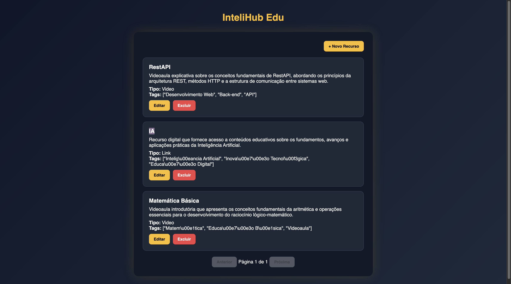
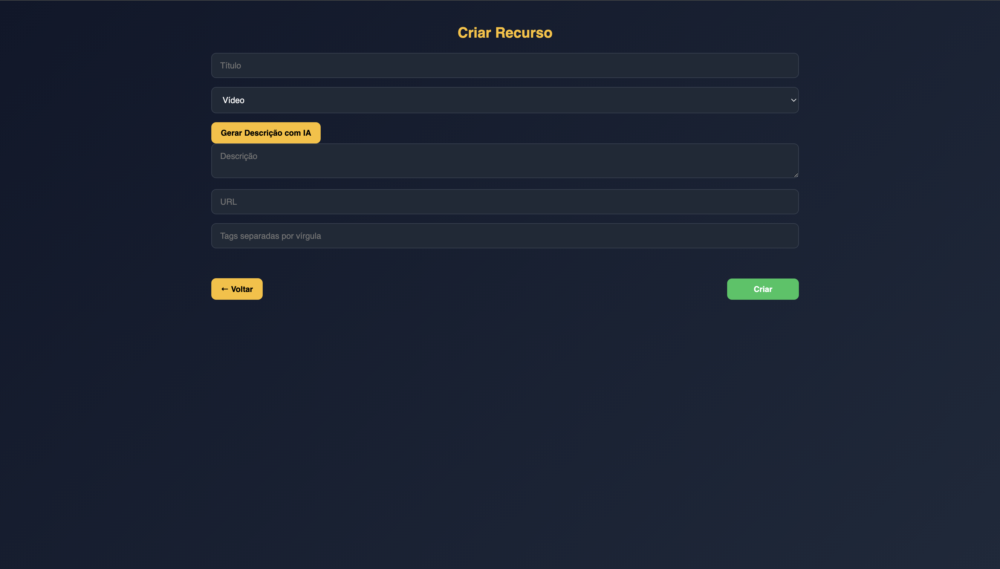
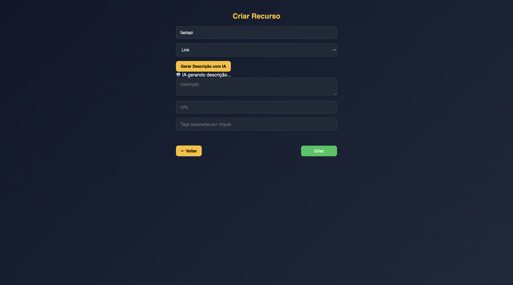
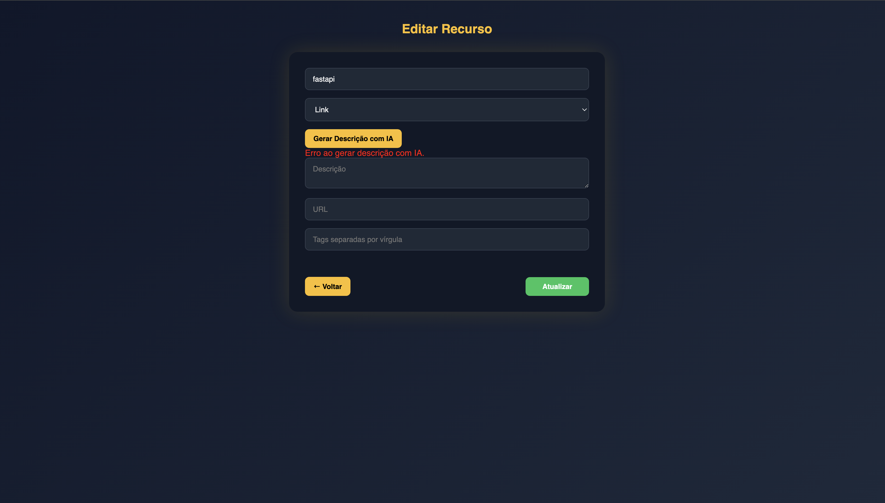
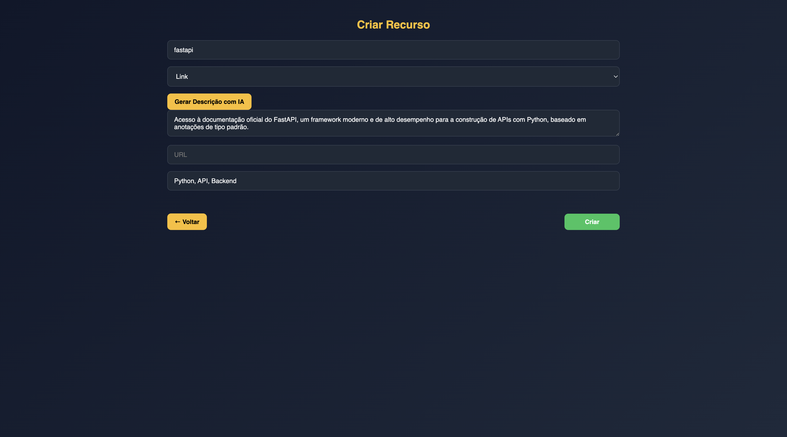

# 🚀 InteliHub-Edu  
### Hub Inteligente de Recursos Educacionais com IA

Aplicação Fullstack desenvolvida como solução para o **Desafio Técnico – Hub Inteligente de Recursos Educacionais**.

O sistema permite o gerenciamento de materiais didáticos e utiliza Inteligência Artificial para sugerir descrições e tags automaticamente a partir do título do recurso.

---

## 🎯 Objetivo do Projeto

Criar uma aplicação moderna que:

- Permite CRUD completo de recursos educacionais
- Utiliza IA para auxiliar no preenchimento automático de descrição e tags
- Implementa boas práticas de arquitetura, organização e observabilidade
- Segue requisitos técnicos definidos no desafio

---

# 🏗️ Arquitetura
InteliHub-Edu
│
├── backend/ → API REST com FastAPI
├── frontend/ → SPA em React + Vite
├── .env
├── docker-compose.yml
└── README.md

---

# 🛠️ Stack Utilizada

## 🔙 Backend
- FastAPI
- Pydantic
- SQLAlchemy
- PostgreSQL
- Google Gemini API
- Python JSON Logger (logs estruturados)

## 🔜 Frontend
- React
- Vite
- React-DOM
- Axios

## 🗄️ Banco de Dados
- PostgreSQL (via Docker)

---

# ⚙️ Funcionalidades

## ✅ 1. CRUD de Recursos

Campos:

- Título
- Descrição
- Tipo (Vídeo | PDF | Link)
- URL
- Tags

Endpoints disponíveis:

| Método | Rota |
|--------|------|
| POST | /resources |
| GET | /resources |
| GET | /resources/{id} |
| PUT | /resources/{id} |
| DELETE | /resources/{id} |
| POST | /resources/smart-assist |
| GET | /health |

---

## 🤖 2. Smart Assist (IA)

No formulário de cadastro existe o botão:

**"Gerar Descrição com IA"**

Fluxo:

1. Frontend envia:
   - Título
   - Tipo
2. Backend chama a API do Google Gemini
3. IA retorna:
   - Descrição sugerida
   - 3 Tags recomendadas (formato JSON estrito)
4. Frontend preenche automaticamente os campos

---

# 🔐 Variáveis de Ambiente

Crie um arquivo `.env` baseado no `.env.example`:
DATABASE_URL=
GEMINI_API_KEY=
POSTGRES_USER=
POSTGRES_PASSWORD=
POSTGRES_DB=

A chave da API **não é hardcoded**, seguindo boas práticas de segurança.

---

# ▶️ Rodando o Projeto

## 1️⃣ Subir banco com Docker 🐳 
```bash
docker-compose up -d
```

## 2️⃣ Rodar Backend ⚡
```bash
cd backend
python -m venv venv
source venv/bin/activate  # Mac/Linux
pip install -r requirements.txt
uvicorn app.main:app --reload
```
#### Acesse:
```
http://localhost:8000/docs
```

## 3️⃣ Rodar Frontend ⚛️
```bash
cd frontend
npm install
npm run dev
```
#### Acesse:
```
http://localhost:5173
```
---

# 📊 Observabilidade (Diferencial)
## ✅ Logs Estruturados (utilizando "python-json-logger")
Exemplo real de log da IA:
```
{"message": "AI Request: Title=\"FastAPI\", Latency=3.86s"}
```

## ✅ Health Check
Endpoint:
```
GET /health
```

---

# 📸 Interface da Aplicação

### 📋 Listagem de Recursos


### ✏️ Edição de Recurso


### ➕ Cadastro com Smart Assist




# 🧪 Qualidade de Código
## ⚙️ Ferramentas utilizadas:

### black → Formatação automática

### flake8 → Linter PEP8

### isort → Organização de imports

Executar:
```bash
isort .
black .
flake8 .
```

# 👨‍💻 Autor

## Desenvolvido por Edson Junior

## Projeto criado para avaliação técnica Fullstack.
